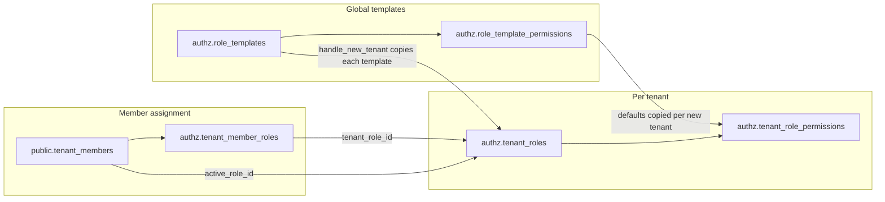

# Multi-Tenant Auth & Authorization System

> Living documentation of the implemented auth system.
> Last updated: 2026-04-07

---

## 1. Architecture

```
Client (Web/Mobile)
       ↓
Supabase Edge Functions
  ├─ Rate limiting (sliding window, Upstash Redis, hybrid fallback)
  ├─ JWT pre-parse (is_locked, session_revoked checks)
  ├─ Token verification (getUser)
  └─ Tenant membership validation
       ↓
Supabase Auth (JWT issuer + custom_access_token_hook)
  └─ Minimal JWT: tid, active_role, roles, pv, sid, flags
  └─ NO permissions in JWT (resolved at DB level)
       ↓
Postgres (RLS enforced — session + DB-driven permissions + tenant)
  └─ authz.has_permission() queries tenant_role_permissions directly
       ↓
Security Engine (risk scoring → session revocation → account lock)
       ↓
Alert Pipeline (pg_notify → dispatch-alerts → Slack / Email / Dashboard)
```

---

## 2. Schema Layout

| Schema    | Purpose                               | Access                                                                                                |
| --------- | ------------------------------------- | ----------------------------------------------------------------------------------------------------- |
| `auth`    | Supabase managed (users, sessions)    | Supabase internal only                                                                                |
| `public`  | Tenants, profiles, tenant members     | `authenticated` via RLS                                                                               |
| `authz`   | Permissions, roles, assignments       | `authenticated` has USAGE (for helper functions) but NO table access. `service_role` has full access. |
| `private` | Sessions, risk scores, events, alerts | `service_role` only                                                                                   |

### Access Control (implemented)

- `authenticated` gets `USAGE` on `authz` to call SECURITY DEFINER helper functions (e.g. `authz.has_permission()`).
- All table access on `authz` is explicitly **revoked** from `authenticated` to prevent reading role/permission data directly.
- `service_role` has full access to both `authz` and `private` schemas (including default privileges for future tables).

---

## 3. Database Tables

### 3.1 public schema

`**tenants`\*\* — Multi-tenant organizations

| Column                  | Type                 | Notes             |
| ----------------------- | -------------------- | ----------------- |
| id                      | uuid PK              | gen_random_uuid() |
| name                    | text NOT NULL        |                   |
| display_name            | text                 |                   |
| slug                    | text UNIQUE NOT NULL |                   |
| logo_url, logo_icon_url | text                 |                   |
| settings                | jsonb                | Default `{}`      |
| created_at, updated_at  | timestamptz          | Auto-managed      |

`**profiles**` — Global user profiles (1:1 with auth.users)

| Column                        | Type        | Notes                                                                                         |
| ----------------------------- | ----------- | --------------------------------------------------------------------------------------------- |
| id                            | uuid PK     | FK → auth.users, CASCADE delete                                                               |
| username                      | text UNIQUE |                                                                                               |
| display_name, avatar_url, bio | text        |                                                                                               |
| is_public                     | boolean     | Default true                                                                                  |
| is_system_admin               | boolean     | Default false. **Protected by trigger** — only existing system admins can modify this column. |
| created_at, updated_at        | timestamptz | Auto-managed                                                                                  |

> A `BEFORE UPDATE` trigger (`protect_profiles_system_admin`) blocks any attempt to change `is_system_admin` unless the caller's JWT already contains `is_system_admin = true`. This prevents privilege escalation.

`**tenant_members`\*\* — User membership within a tenant

| Column                   | Type          | Notes                                         |
| ------------------------ | ------------- | --------------------------------------------- |
| id                       | uuid PK       |                                               |
| tenant_id                | uuid NOT NULL | FK → tenants, CASCADE                         |
| user_id                  | uuid NOT NULL | FK → auth.users, CASCADE                      |
| status                   | text          | `'active'` or `'suspended'`                   |
| active_role_id           | uuid          | FK → authz.tenant_roles, SET NULL on delete          |
| display_name, avatar_url | text          | Tenant-specific overrides                     |
| permission_version       | integer       | Default 1. Bumped on role/permission changes. |
| created_at, updated_at   | timestamptz   |                                               |
|                          |               | UNIQUE (tenant_id, user_id)                   |

> `active_role_id` persists across logouts. On next login the hook reads this value. If a user has exactly one assigned role, the hook auto-sets it.

### 3.2 authz schema

How the three role-related objects fit together (same behavior as before; clearer names after migrations `20260421120000_rename_authz_role_tables` and `20260421140000_authz_rename_junction_tables`):



`**permissions**` — Global permission keys (e.g. `items.read`, `tenant_members.manage`).

`**role_templates**` — Global catalog of role templates (`tenant_admin`, `platform_admin`, …). When a tenant is created, `handle_new_tenant()` inserts one `authz.tenant_roles` row per template for that tenant.

`**tenant_roles**` — Tenant-scoped role instances. `slug` is unique per `tenant_id`. Optional `template_key` FK → `role_templates.key` records which template the row came from.

`**tenant_role_permissions**` — Maps each `tenant_roles.id` to `permissions.id`. This is where **effective** grants live for RLS (`has_permission`). On tenant creation, `handle_new_tenant()` seeds rows from **`authz.role_template_permissions`** (defaults per `role_templates.key`); admins may add or remove rows later per tenant.

`**role_template_permissions**` — Global default grants per template (`template_key` → `permissions.id`). Copied into `tenant_role_permissions` for every new tenant. Local dev seeds rows in `supabase/seed/auth_authz_seed.sql`; production-style environments should seed or migrate the same rows before creating tenants.

`**tenant_member_roles**` — Many-to-many: which `tenant_roles` a `tenant_member` may use. `tenant_members.active_role_id` picks the one `authz.has_permission()` consults.

### 3.3 private schema

`**auth_sessions**` — Application-level session metadata layered on top of Supabase Auth sessions. Tracks tenant binding, refresh token hash, device info, and revocation status. The `id` corresponds to the Supabase session ID.

> **Revoked sessions cannot be rebound.** The `bind_auth_session` function's ON CONFLICT clause includes `WHERE is_revoked = false`. Attempting to rebind a revoked session raises an exception.

`**security_events**` — Immutable log of all security-relevant events (failed logins, risk escalations, token replay, etc.). **Partitioned by month** (`PARTITION BY RANGE (created_at)`). Initial partitions for 2026 Q2 are created at migration time. New partitions are auto-created monthly by a pg_cron job.

`**audit_logs**` — Automatic change capture. **Partitioned by month** (`PARTITION BY RANGE (created_at)`). A trigger (`private.capture_audit_log`) fires on INSERT/UPDATE/DELETE on tenants, profiles, tenant_members, tenant_roles, tenant_role_permissions, role_template_permissions, and tenant_member_roles. Records the user_id (from JWT `sub`), tenant_id (from JWT `tid`), old/new data, and IP address.

> Both tables have a default partition that catches rows for months without explicit partitions. The `create-monthly-partitions` pg_cron job creates next month's partition on the 1st of each month.

`**user_risk_scores**` — Per-user abuse tracking. Score accumulates from security events; thresholds trigger session revocation (≥20) and account lock (≥30, 24h).

`**security_alerts**` — Delivery tracking for alerts. Created automatically by a trigger when a security event is inserted. Channels: `email`, `slack`, `dashboard`.

### 3.4 Indexes

Implemented on: `tenant_members(user_id)`, `tenant_members(tenant_id, status)`, `tenant_roles(tenant_id)`, `tenant_role_permissions(permission_id)`, `tenant_member_roles(tenant_member_id)`, `tenant_member_roles(tenant_role_id)`, `auth_sessions(user_id, is_revoked)`, `auth_sessions(tenant_id)`, `security_events(user_id, created_at DESC)`, `security_events(tenant_id, created_at DESC)`, `audit_logs(tenant_id, created_at DESC)`, `audit_logs(resource_type, resource_id)`, `security_alerts(status, created_at DESC)`.

---

## 4. JWT Claims (Custom Access Token Hook)

The `custom_access_token_hook` runs on every token mint/refresh and injects these claims:

```json
{
  "sub": "user-uuid",
  "sid": "session-uuid",
  "tid": "tenant-uuid",
  "active_role": "project_engineer",
  "roles": ["project_engineer", "project_checker"],
  "pv": 3,
  "is_system_admin": false,
  "is_locked": false,
  "session_revoked": false
}
```

> **No `perms` in JWT.** Permissions are resolved at the DB level by `authz.has_permission()`, which queries `tenant_role_permissions` directly. This keeps the token size constant (~500 bytes) regardless of how many permissions a role has, avoiding the ~8KB HTTP header limit.

| Claim             | Source                                                 | Purpose                              |
| ----------------- | ------------------------------------------------------ | ------------------------------------ |
| `sid`             | `auth.sessions.id` via JWT `session_id`                | Session tracking                     |
| `tid`             | `private.auth_sessions.tenant_id`                      | Active tenant context                |
| `active_role`     | `authz.tenant_roles.slug` via `tenant_members.active_role_id` | Current role for UI display          |
| `roles`           | All slugs from `authz.tenant_member_roles`             | Role switcher in frontend            |
| `pv`              | `tenant_members.permission_version`                    | Stale-JWT detection                  |
| `is_system_admin` | `profiles.is_system_admin`                             | System admin bypass                  |
| `is_locked`       | `user_risk_scores.is_locked`                           | Account lockout flag                 |
| `session_revoked` | `auth_sessions.is_revoked` OR `expires_at <= now()`    | Session invalidation                 |

> **Note:** The claim is named `active_role` (not `role`) to avoid colliding with Supabase's built-in `role` claim which contains `"authenticated"` or `"anon"`.

### Hook Grants

The hook is granted to `supabase_auth_admin` only. It is explicitly revoked from `authenticated`, `anon`, and `public`. The hook has SELECT access on profiles, tenant_members, tenant_roles, tenant_member_roles, auth_sessions, and user_risk_scores, plus UPDATE on tenant_members (for auto-setting active_role_id).

---

## 5. RLS Helper Functions (authz schema)

All are `STABLE`, `SECURITY DEFINER`, `SET search_path = ''`. Granted to `authenticated`.

| Function                           | Returns | Purpose                                                                   |
| ---------------------------------- | ------- | ------------------------------------------------------------------------- |
| `authz.current_tenant_id()`        | uuid    | Read `tid` from JWT                                                       |
| `authz.current_session_id()`       | uuid    | Read `sid` from JWT                                                       |
| `authz.current_active_role()`      | text    | Read `active_role` from JWT                                               |
| `authz.has_permission(p text)`     | boolean | **DB-driven.** Resolves user's active role from `tenant_members`, then checks `tenant_role_permissions` for the given key. Does NOT read from JWT. |
| `authz.is_system_admin()`          | boolean | Read `is_system_admin` from JWT                                           |
| `authz.is_session_valid()`         | boolean | `session_revoked` is false                                                |
| `authz.is_account_locked()`        | boolean | `is_locked` is true                                                       |
| `authz.check_permission_version()` | boolean | JWT `pv` ≥ DB `permission_version`                                        |

> `authz.has_permission()` is the **single source of truth** for permission checks. It is used by both RLS policies and Edge Functions (via `check_user_permission` RPC). There is no duplicate permission logic.

---

## 6. RLS Policies

RLS is enabled on `tenants`, `profiles`, and `tenant_members`. All policies enforce two baseline guards:

```
authz.is_session_valid() AND NOT authz.is_account_locked()
```

### tenants

| Operation              | Who can access                                           |
| ---------------------- | -------------------------------------------------------- |
| SELECT                 | System admin OR user has active membership in the tenant |
| INSERT, UPDATE, DELETE | System admin only                                        |

### profiles

| Operation | Who can access                                                                  |
| --------- | ------------------------------------------------------------------------------- |
| SELECT    | System admin, own profile, public profiles, or same-tenant co-members           |
| INSERT    | System admin or own profile                                                     |
| UPDATE    | System admin or own profile (but `is_system_admin` column protected by trigger) |
| DELETE    | System admin only                                                               |

### tenant_members

| Operation              | Who can access                                                                                                                                                                                                                 |
| ---------------------- | ------------------------------------------------------------------------------------------------------------------------------------------------------------------------------------------------------------------------------ |
| SELECT                 | System admin, OR (within current tenant: own row, or `tenant_members.manage` permission). Self-row visibility is scoped to current tenant only — prevents cross-tenant membership enumeration. Requires `check_permission_version()`. |
| INSERT, UPDATE, DELETE | System admin, OR `tenant_members.manage` permission within current tenant. Requires `check_permission_version()`.                                                                                                                     |

### RLS pattern for future business tables

```sql
create policy "items_select" on public.items for select to authenticated
using (
  authz.is_session_valid()
  and not authz.is_account_locked()
  and (
    authz.is_system_admin()
    or (
      tenant_id = authz.current_tenant_id()
      and authz.has_permission('items.read')
      and authz.check_permission_version()
    )
  )
);
```

---

## 7. Edge Functions

All Edge Functions use the shared `_shared/runtime.ts` module which provides centralized middleware.

### Middleware pipeline (`requireUserContext`)

Every authenticated Edge Function runs through this pipeline:

1. Extract and decode Bearer token (base64url payload parse — does NOT verify signature)
2. Verify token server-side via `getUser()`
3. Reject locked accounts (`is_locked` claim)
4. Reject revoked sessions (`session_revoked` claim)

### Implemented functions

| Function              | Auth                             | Rate Limit (mode)          | Purpose                                                                                                                                        |
| --------------------- | -------------------------------- | -------------------------- | ---------------------------------------------------------------------------------------------------------------------------------------------- |
| `bind-session`        | Bearer token                     | 30/min per user (strict)   | Bind Supabase session to `private.auth_sessions` with tenant, device metadata, refresh token hash. Validates tenant membership before binding. |
| `refresh-session`     | Bearer token                     | 30/min per user (strict)   | Rotate refresh token hash. Detects replay (hash mismatch → revoke all sessions + risk event).                                                  |
| `switch-tenant`       | Bearer token                     | 20/min per user+IP (strict) | Switch active tenant. Validates membership, updates session tenant_id, optionally refreshes token.                                            |
| `switch-role`         | Bearer token                     | 30/min per user+tenant (strict) | Switch active role within current tenant. Updates `active_role_id`, optionally refreshes token.                                           |
| `add-member`          | Bearer token + DB `tenant_members.manage` | 20/min per tenant (moderate) | Find-or-create user, upsert profile, sync tenant membership + roles. Permission checked via `check_user_permission` RPC. Only system admins can assign `tenant_admin`. |
| `assign-tenant-admin` | Bearer token + `is_system_admin` | 10/min per user (moderate) | System-admin-only. Assign a user as `tenant_admin` for a specific tenant.                                                                      |
| `dispatch-alerts`     | Cron secret or service role key  | N/A (internal)             | Fetch pending alerts, dispatch to Slack/email. Dashboard alerts are skipped (remain `pending` for UI).                                         |

> Edge Functions do NOT duplicate permission checks. The `add-member` function validates `tenant_members.manage` via the `check_user_permission` DB RPC (same `authz.has_permission` logic). All other permission enforcement is handled by RLS policies in the database.

### Rate limiting

Sliding-window algorithm using Upstash Redis sorted sets:

1. `ZREMRANGEBYSCORE` — remove entries older than the window
2. `ZADD` — add current request with timestamp as score
3. `ZCARD` — count entries = request count in window
4. `EXPIRE` — auto-cleanup TTL

**Hybrid fallback** when Redis is unavailable:

| Mode       | Behavior                                  | Used for                           |
| ---------- | ----------------------------------------- | ---------------------------------- |
| `strict`   | Block request (fail closed)               | Auth endpoints (bind, refresh, switch) |
| `moderate` | Fall back to in-memory per-isolate limiter | Mutations (add-member, assign-admin) |
| `relaxed`  | Allow + log warning                       | Read-only endpoints (future)       |

The in-memory fallback provides best-effort protection per Deno isolate when Redis is down, preventing total system outage while still limiting abuse for sensitive endpoints.

### CORS

Origin allowlist is configured via the `ALLOWED_ORIGINS` environment variable (comma-separated). When not set (local dev), the request `Origin` header is reflected back. Preflight responses return `204 No Content`.

### Security: dispatch-alerts authentication

The `dispatch-alerts` function uses HMAC-based constant-time comparison for secret validation (both cron secret and service role key). This prevents timing side-channel attacks.

---

## 8. Session Management

### Lifecycle

1. **Bind** — After sign-in, the client calls `bind-session` to link the Supabase session to `private.auth_sessions` with IP, user agent, tenant, and hashed refresh token.
2. **Touch** — On tenant switch, `touch_auth_session` updates `tenant_id` and `last_active_at`.
3. **Refresh** — On token refresh, `handle_token_refresh` validates the incoming token hash, rotates to the new hash, and increments `refresh_token_seq`.
4. **Revoke** — `revoke_user_sessions` sets `is_revoked = true` on all active sessions. The hook strips permissions on next token mint.
5. **Expire** — Sessions have explicit `expires_at`. The hook treats expired sessions as revoked.
6. **Cleanup** — A pg_cron job runs daily at 02:15 UTC, deleting revoked/expired sessions older than 30 days.

### Refresh token reuse detection

If an incoming refresh token hash doesn't match the stored hash (indicating the token was already rotated), all of the user's sessions are revoked and a `refresh_token_reuse` risk event (+10 points) is recorded. This is a critical security event.

### Revoked sessions cannot be rebound

The `bind_auth_session` ON CONFLICT clause includes `WHERE is_revoked = false`. If a session was revoked (e.g. by risk escalation), rebinding it raises a `check_violation` exception.

---

## 9. Risk Scoring & Account Lockout

### Point values

| Event                 | Points |
| --------------------- | ------ |
| `failed_login`        | +2     |
| `permission_denied`   | +2     |
| `rate_limit_hit`      | +3     |
| `new_ip`              | +5     |
| `session_revoked`     | +1     |
| `refresh_token_reuse` | +10    |

### Escalation thresholds

| Score | Action                     |
| ----- | -------------------------- |
| ≥ 20  | Revoke all active sessions |
| ≥ 30  | Lock account for 24 hours  |

### Score decay

A pg_cron job runs hourly (`auth-risk-score-decay`), decrementing each user's score by 1 (minimum 0). If `locked_until` has passed, `is_locked` is set back to false.

---

## 10. Security Alerting

### Alert creation

A trigger on `private.security_events` automatically creates alert rows in `private.security_alerts`:

| Severity   | Channels                  |
| ---------- | ------------------------- |
| Critical   | Email + Slack + Dashboard |
| High       | Slack + Dashboard         |
| Medium/Low | Dashboard only            |

A second trigger sends `pg_notify('security_alerts', ...)` for critical/high events.

### Alert dispatch

The `dispatch-alerts` Edge Function (intended to run on a 1-minute cron):

1. Fetches up to 100 pending alerts
2. **Skips dashboard alerts** — they remain `pending` for the admin UI to display
3. Sends Slack alerts via webhook, email alerts via Resend
4. Marks each as `sent` or `failed`

### Alert acknowledgment

System admins acknowledge dashboard alerts via `private.acknowledge_security_alert(alert_id, user_id)`, which sets `status = 'acknowledged'`.

---

## 11. Permission Version Invalidation

When permissions change, the affected user's JWT must be refreshed:

1. A trigger on `authz.tenant_member_roles` (INSERT/DELETE) calls `authz.bump_permission_version()` on the affected tenant member.
2. A trigger on `authz.tenant_role_permissions` (INSERT/DELETE) bumps the version for all members who have that role assigned.
3. On the next request, `authz.check_permission_version()` detects `jwt.pv < db.permission_version` and the RLS policy rejects the request.
4. The client detects the rejection and calls `auth.refreshSession()` to get a fresh JWT.

---

## 12. Tenant & Role Switching

### Tenant switching (`POST /functions/v1/switch-tenant`)

Body: `{ "tenant_id": "uuid", "refresh_token?": "string" }`

1. Validates the user has an active membership in the target tenant
2. Updates `private.auth_sessions.tenant_id` via `touch_auth_session`
3. Optionally refreshes the Supabase Auth token so claims take effect immediately
4. Returns `{ tenant_id, session_refresh_required, session? }`

### Role switching (`POST /functions/v1/switch-role`)

Body: `{ "role_slug": "string", "refresh_token?": "string" }`

1. Validates the user has the role assigned within their current tenant
2. Updates `tenant_members.active_role_id` via `switch_active_role`
3. Optionally refreshes the token
4. Returns `{ active_role, session_refresh_required, session? }`

The user stays logged in. Only the JWT claims change. The frontend uses `roles` from the JWT for the role switcher and `active_role` to highlight the current one.

---

## 13. User & Member Management

### Tenant admin assignment (`POST /functions/v1/assign-tenant-admin`)

System-admin-only. Body: `{ "tenant_id", "email", "password?", "display_name?", "avatar_url?" }`

1. Validates caller is system admin
2. Verifies the tenant exists
3. Finds or creates the user in Supabase Auth (paginated search, max 1,000 users)
4. Upserts profile
5. Syncs membership with `tenant_admin` role via `sync_tenant_member_roles`

### Member assignment (`POST /functions/v1/add-member`)

Requires `tenant_members.manage` permission. Body: `{ "email", "role_slugs", "password?", "display_name?", "avatar_url?", "active_role_slug?" }`

1. Validates caller has `tenant_members.manage` permission in their active tenant
2. Only system admins can include `tenant_admin` in `role_slugs`
3. Finds or creates the user
4. Upserts profile
5. Syncs membership and roles via `sync_tenant_member_roles`

### Tenant role seeding

When a tenant is created, the `handle_new_tenant` trigger copies all `authz.role_templates` into `authz.tenant_roles` for that tenant (with `ON CONFLICT DO NOTHING` for idempotency), then copies **`authz.role_template_permissions`** into **`authz.tenant_role_permissions`** for those roles (matched by `template_key`). No per-tenant manual permission seeding is required for templates that have default rows.

---

## 14. Role Definitions

### system_admin

Not a tenant role — stored as `profiles.is_system_admin`. Injected into JWT by the hook. Bypasses tenant-scoped RLS. Protected by a trigger that blocks non-admin writes.

### Tenant roles (seeded from role_templates)

| Role                 | Purpose                                                    |
| -------------------- | ---------------------------------------------------------- |
| `tenant_admin`       | Full tenant administration (assigned by system_admin only) |
| `project_engineer`   | Day-to-day project execution                               |
| `project_head`       | High-level project oversight                               |
| `project_maker`      | Creates/authors project deliverables                       |
| `project_checker`    | Reviews deliverables for quality                           |
| `project_verifier`   | Verifies completed work                                    |
| `project_supervisor` | Broad project supervision                                  |

New tenant roles start with no permissions. The seed migration grants the KKM Infra `tenant_admin` all 13 permission keys: `items.read`, `items.manage`, `tenant_members.manage`, `roles.read`, `roles.manage`, `roles.assign`, `tenants.read`, `tenants.manage`, `alerts.read`, `alerts.acknowledge`, `sessions.revoke`, `audit.read`, `profiles.manage`.

---

## 15. Audit Logging

Automatic change capture via `private.capture_audit_log()` trigger on:

- `public.tenants`
- `public.profiles`
- `public.tenant_members`
- `authz.tenant_roles`
- `authz.tenant_role_permissions`
- `authz.role_template_permissions`
- `authz.tenant_member_roles`

Each audit row captures: user_id and tenant_id (from JWT claims), action (insert/update/delete), resource_type (`schema.table`), resource_id, old_data, new_data, and ip_address.

---

## 16. Triggers Summary

| Trigger                             | Table                                                                           | Event                      | Function                            |
| ----------------------------------- | ------------------------------------------------------------------------------- | -------------------------- | ----------------------------------- |
| `set_*_updated_at`                  | tenants, profiles, tenant_members, tenant_roles, user_risk_scores                      | BEFORE UPDATE              | `handle_updated_at()`               |
| `on_auth_user_created`              | auth.users                                                                      | AFTER INSERT               | `handle_new_user_profile()`         |
| `on_tenant_created`                 | tenants                                                                         | AFTER INSERT               | `handle_new_tenant()`               |
| `protect_profiles_system_admin`     | profiles                                                                        | BEFORE UPDATE              | `protect_system_admin_flag()`       |
| `bump_pv_on_member_role_change`     | tenant_member_roles                                                             | AFTER INSERT/DELETE        | `authz.on_member_role_change()`     |
| `bump_pv_on_role_permission_change` | tenant_role_permissions                                                                | AFTER INSERT/DELETE        | `authz.on_role_permission_change()` |
| `audit_`\*                          | tenants, profiles, tenant_members, tenant_roles, tenant_role_permissions, role_template_permissions, tenant_member_roles | AFTER INSERT/UPDATE/DELETE | `private.capture_audit_log()`       |
| `on_security_event_create_alerts`   | security_events                                                                 | AFTER INSERT               | `private.create_security_alerts()`  |
| `on_security_event_notify`          | security_events                                                                 | AFTER INSERT               | `private.notify_security_alert()`   |

---

## 17. Scheduled Jobs (pg_cron)

| Job                         | Schedule                        | Function                                                                               |
| --------------------------- | ------------------------------- | -------------------------------------------------------------------------------------- |
| `auth-risk-score-decay`     | Every hour (0 \* \* \* \*)     | `private.decay_risk_scores()` — decrement scores by 1, unlock expired locks            |
| `auth-session-cleanup`      | Daily at 02:15 UTC              | `private.cleanup_auth_sessions()` — delete revoked/expired sessions older than 30 days |
| `create-monthly-partitions` | 1st of month at 00:00 UTC       | `private.create_monthly_partitions()` — auto-create next month's partitions for security_events and audit_logs |

---

## 18. Seed Data Strategy

Schema is applied by migrations only (`supabase/migrations/`). After each `supabase db reset`, SQL seeds run in order from `config.toml` (`db.seed.sql_paths`): `seed.sql` then `seed/auth_authz_seed.sql` (local/CI dev users, authz catalog, tenants). App data (schedules, units, and so on) is loaded separately (for example `pnpm seed:app`).

### Key design decisions

- **No auth users in migrations**: Dev users and catalog data live in seed SQL, not in versioned schema migrations.
- **`db push` applies migrations only**: Hosted preview/production do not run `seed.sql` on push unless you configure that separately.
- **Idempotent seeds**: Seed files use `ON CONFLICT` patterns where appropriate.
- **Production admin bootstrap**: After deploying, the first admin signs up via Auth, then is promoted as needed (`profiles.is_system_admin`, membership sync).
- **Future tenants**: Created at runtime via APIs or admin flows.

---

## 19. Testing

### pgTAP test helpers

`tests.set_auth_context()` simulates an authenticated user by setting `role = 'authenticated'` and `request.jwt.claims` to a JSON object matching the hook's output. No `p_perms` parameter — permissions are resolved from the DB via `authz.has_permission()`. Granted only to `postgres` (the test runner), NOT to `authenticated`.

### Current test coverage (supabase/tests/auth_rls.sql)

9 test assertions covering `tenant_members` RLS:

1. Cross-tenant isolation (SELECT blocked)
2. Own-tenant self-row visibility
3. INSERT works when role has `tenant_members.manage` permission in DB
4. Permission removal from role blocks INSERT
5. Revoked session blocks all access
6. Locked account blocks all access
7. System admin cross-tenant visibility
8. Stale permission version blocks access

> Tests validate that permissions are resolved from `tenant_role_permissions` rows in the DB, not from JWT claims.

Run with: `supabase test db`

---

## 20. Environment Variables

### Edge Functions

| Variable                    | Required            | Purpose                         |
| --------------------------- | ------------------- | ------------------------------- |
| `SUPABASE_URL`              | Yes                 | Supabase project URL            |
| `SUPABASE_ANON_KEY`         | Yes                 | Public anon key                 |
| `SUPABASE_SERVICE_ROLE_KEY` | Yes                 | Service role key (bypasses RLS) |
| `UPSTASH_REDIS_REST_URL`    | Yes (production)    | Rate limiting backend           |
| `UPSTASH_REDIS_REST_TOKEN`  | Yes (production)    | Rate limiting auth              |
| `ALLOWED_ORIGINS`           | Recommended         | Comma-separated CORS allowlist  |
| `INTERNAL_CRON_SECRET`      | For dispatch-alerts | Cron job authentication         |
| `SLACK_WEBHOOK_URL`         | For Slack alerts    | Slack incoming webhook          |
| `RESEND_API_KEY`            | For email alerts    | Resend API key                  |
| `ALERT_EMAIL_FROM`          | For email alerts    | Sender address                  |
| `ALERT_EMAIL_TO`            | For email alerts    | Recipient address               |

---

## 21. File Map

```
supabase/
├── config.toml                                    # Auth settings, hook config
├── migrations/
│   └── 20260422180000_init_schema.sql              # Squashed baseline (schema + RLS + functions + hooks)
├── seed.sql                                        # No-op placeholder; ordering hook for seeds
├── seed/
│   └── auth_authz_seed.sql                         # Local/CI auth + authz catalog and dev users
├── functions/
│   ├── _shared/runtime.ts                          # Shared middleware, rate limiting, CORS, helpers
│   ├── bind-session/index.ts
│   ├── refresh-session/index.ts
│   ├── switch-tenant/index.ts
│   ├── switch-role/index.ts
│   ├── add-member/index.ts
│   ├── assign-tenant-admin/index.ts
│   ├── dispatch-alerts/index.ts
│   └── deno.json
├── tests/
│   └── auth_rls.sql                                # pgTAP RLS integration tests
└── plans/
    └── auth.md                                     # This document
```

---

## 22. Core Principles

- **Permissions are the single source of truth in the DB.** `authz.has_permission()` queries `tenant_role_permissions` directly — no duplication in JWT or Edge Functions.
- **JWT is minimal.** Only identity, tenant, role slugs, and security flags. No permission arrays. Scales to unlimited permissions without token bloat.
- **RLS is the final security boundary.** Edge Functions validate session/tenant; RLS enforces permissions.
- **System admin is NOT a tenant role.** It is a profile flag protected by a trigger.
- **Session validity is checked at both hook and RLS level.** Locked/revoked users are blocked in the JWT (security flags) AND in RLS policies.
- **Permission staleness is detected and forces refresh.** The `pv` claim vs DB `permission_version`.
- **Rate limiting uses hybrid fallback.** Strict (block) for auth endpoints, moderate (in-memory fallback) for mutations, relaxed (allow + log) for reads.
- **Every schema has explicit access control.** `authenticated` cannot read authz tables.
- **Audit and security logs are partitioned by month.** Auto-created via pg_cron for sustainable growth.
- **Audit and security logs are captured automatically.** Not manually.
- **Seed data is a migration, not a seed file.** One idempotent migration applies to all environments. `seed.sql` is for local dev fixtures only.

---

```
Data      → public
Decisions → authz
Secrets   → private
```
